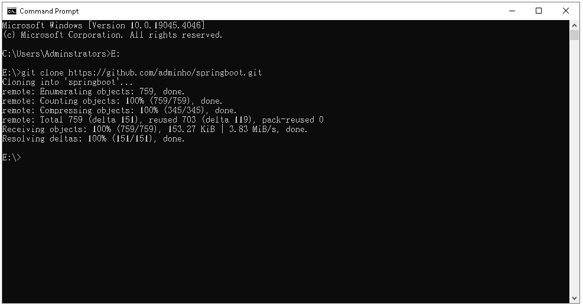
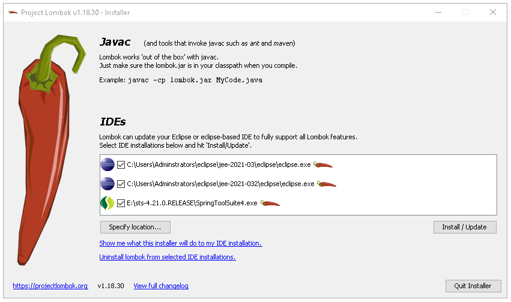
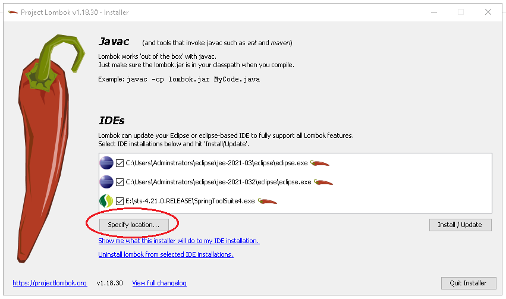
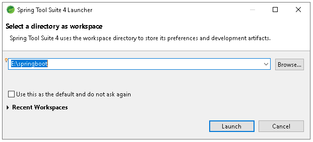
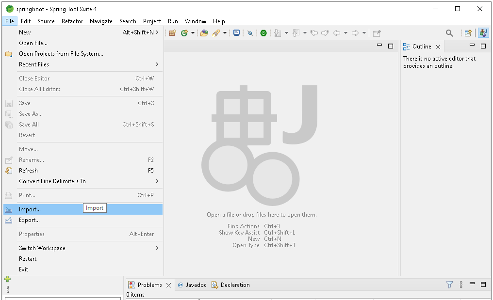
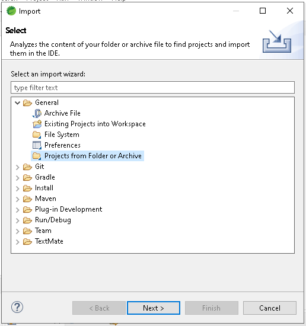
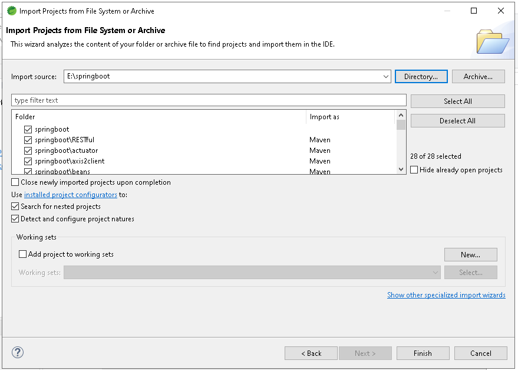
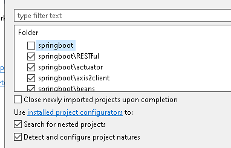

# เป็นตัวอย่าง springboot โปรเจค่างๆ

# วิธีการติดตั้งโปรเจคนี้
1. clone โปรเจคนี้ ด้วยคำสั่ง
```
cd <your_directory>
git clone https://github.com/adminho/springboot.git
```

ก็จะได้โฟลเดอร์ <your_directory>/springboot

2. ดาวน์โหลดไฟล์ lombok.jar https://projectlombok.org/download
   
4. ดับเบิลคลิก lombok.jar -> เลือกไฟล์ Ecplise.exe หรือ SpringToolSuite4.exe ที่จะปลั๊กอิน lombok เข้าไป (ปกติมันจะสแกนหาเจอให้อัตโนมัติ)


5. ถ้าข้อ 3 ไม่เจอให้เลือก specify location


7. เปิด Ecplise หรือ SpringToolSuite4 -> เลือก Workspace เป็นโฟลเดอร์ <your_directory> ที่เดียวกับข้อ 1 


9. เลือก File -> เลือก Import


10. จากนั้นเลือก General -> Projects from Folder or Achive -> เสร็จแล้วกด Next


11. เลือก Directory -> เลือกโฟลเดอร์ <your_directory> เพื่อนำเข้าทุกโปรเจค ยกเว้น ข้อ 9


12. ติ๊กโฟลเดอร์ <your_directory> ออกไป ไม่ import -> เสร็จแล้วกด Finish    


13. รอให้ update โปรเจคจนเสร็จสิ้น (ใช้เวลานานหน่อย)

